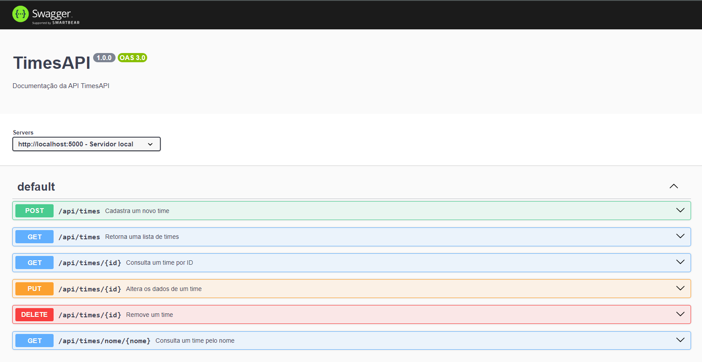
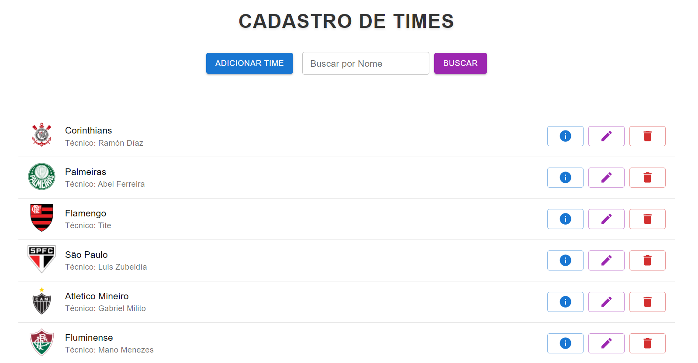

## 🛠️ Desenvolvimento de APIs
Criando API RESTful com Node.js e Express, estruturando rotas e implementando operações CRUD básicas.

## 🗃️ Banco de Dados
Conexão com MongoDB utilizando Mongoose. 

## **Pré-requisitos:**

1. **Node.js (LTS)** 
Certifique-se de ter o Node.js instalado.

2. **Visual Studio Code**  
Utilize o Visual Studio Code como seu ambiente de desenvolvimento

3. **MongoDB**
Crie uma conta https://cloud.mongodb.com/ e projeto para banco para armazenar os dados.

4. **MongoDB**
No arquivo backend/src/app.js o método connetc recebe a string de conexão do banco Mongo, assim que efetuar o passo 3, é necessário pegar sua string de conexão para inserir no método.
Também é necessário a criação de um arquivo `.env` na pasta raiz do projeto, o arquivo deve conter SENHA_MONGODB = 'Aqui sua senha' 

API RESTful em Node.js para um sistema de cadastro de Times. A API deve incluir as seguintes funcionalidades:

1. **Cadastro de times**: Permita que os usuários cadastrem times pelo endpoint POST informando tecnico, nome, estadio, pais, local, ano fundacao e torcida. Todos os campos são obrigatórios.
2. **Listagem de times**: Endpoint GET para listar todos os times cadastrados.
3. **Consulta de time por ID**: Endpoint GET/ID que permita consultar um time específico usando seu ID.
4. **Remoção de Time**: Endpoint DELETE para deletar um time utilizando seu ID.
5. **Atualização de time**: Endpoint PUT para atualizar um time.
6. **Banco de Dados**: MongoDB como banco de dados.

Para verificar todas as rotas consultar o arquivo no caminho `backend/src/routes.js`

#### **Requisitos técnicos:**
- Crie uma conta https://cloud.mongodb.com/ e projeto para banco para armazenar os dados.

### **Documentação Swagger:**
- http://localhost:5000/api-times/


## **Subindo a API 🚀**
1. Clonar o repositório e instalar as dependências:

```
npm install
```

2. Para executar a API execute:

```
npm start
```



## **Subindo o FrontEnd 🚀**
1. Acessar a pasta frontend

```
cd frontend
```

2. Instalar as dependencias

```
npm install
```

3. Subir aplicação web

```
npm run start
```



## **Testes com Supertest e Jest 🚀**
- Os testes estão desenvolvidos baseados na massa de dados criada localmente e do meu banco de dados. 
- Para executa-los, será necessário adaptar a massa de dados.
- O arquivo `.env`deve conter URL_BASE = 'url'

1. Instalar as dependências
 ```
npm install
```

2. Executar os testes
```
npm tests
```